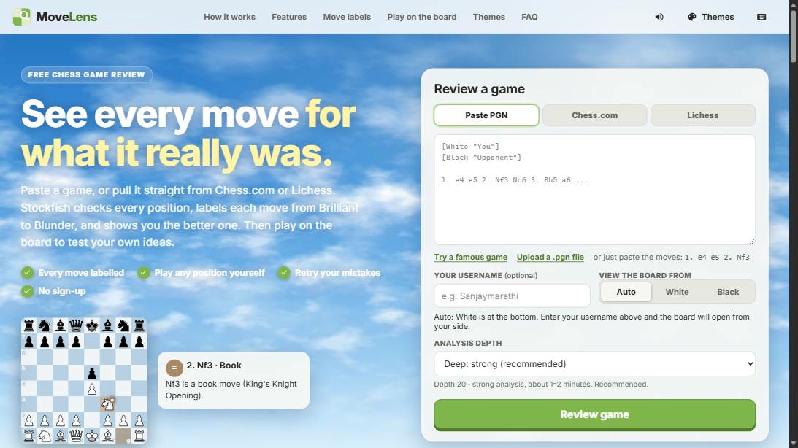
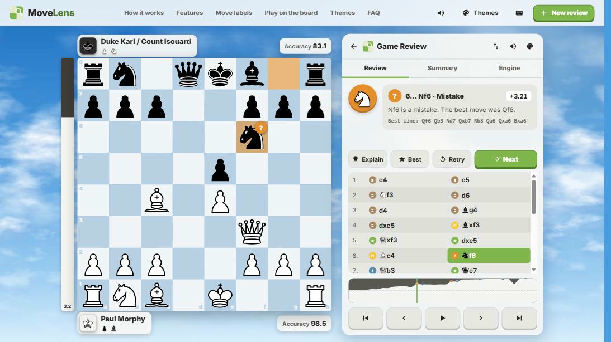
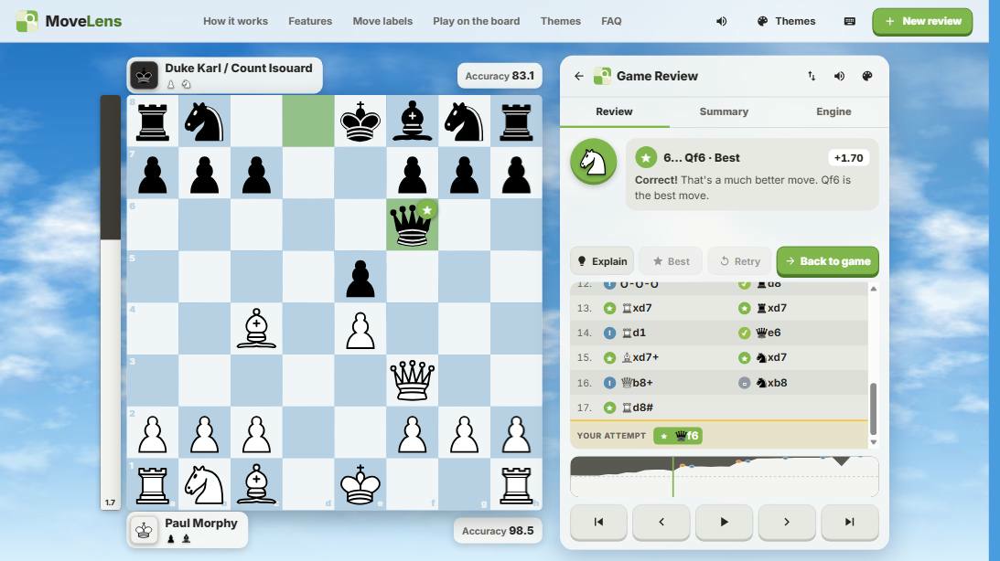
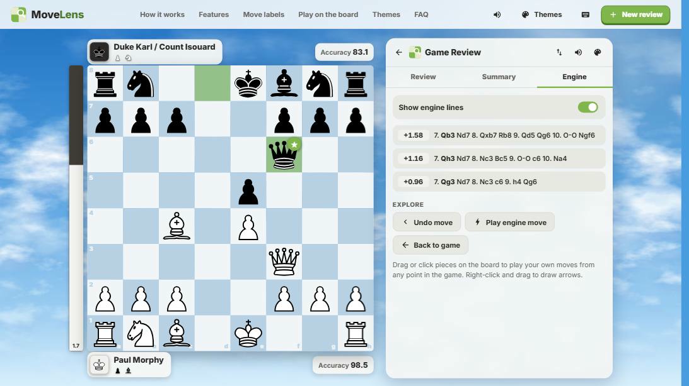
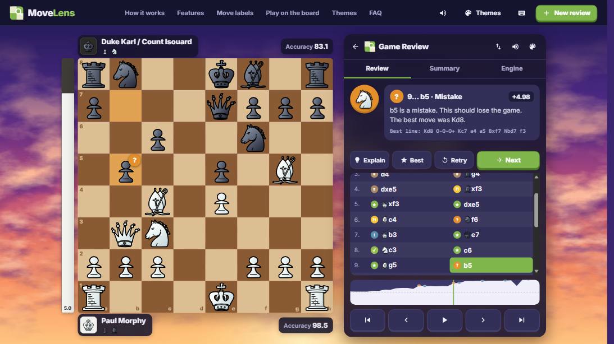
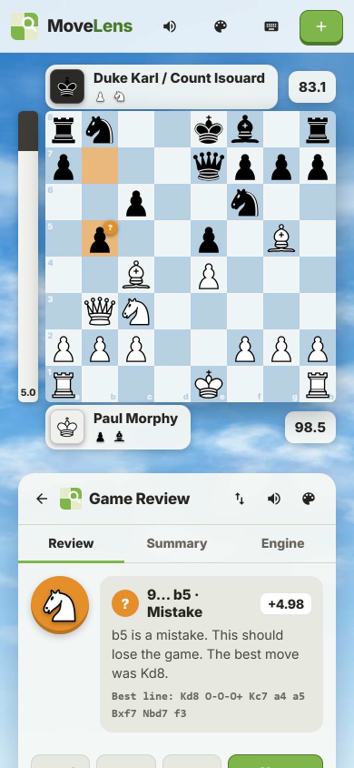

<div align="center">

# ♟️ MoveLens

**Free chess game review.** Stockfish 19 labels every move from *Brilliant* to *Blunder*, shows the better move, and lets you **play on the board** to test your own ideas. Import games from Chess.com or Lichess in one click.

[**Live demo**](https://sanjaymarathi-movelens.hf.space) · [How it works](docs/HOW_IT_WORKS.md) · [Deploy guide](docs/DEPLOY.md)




</div>

## What it does

- **Reviews a whole game.** Stockfish checks every position and each move gets one of 11 labels (Brilliant, Great, Best, Excellent, Good, Book, Forced, Inaccuracy, Mistake, Miss, Blunder) with a plain-English coach comment, the better move as an arrow, an evaluation bar and graph, and an accuracy score per player.
- **Lets you play on the board.** Drag or click any piece at any point of the game and get the engine's verdict on your move. **Retry** a mistake and try to find the better move. Switch on the **top three engine lines** for any position and click a line to play it.
- **Imports games** by pasting a PGN, uploading a file, or typing a **Chess.com / Lichess username**. Type your username and the board opens from *your* side.
- **Works offline and remembers everything.** Reviews, the side lines you explored, every engine answer, and even the app itself are kept in your browser (Service Worker + IndexedDB). A position you have seen is answered instantly with zero server calls.
- **Looks good.** Responsive from phone to wide monitor, 6 scenes, 12 boards, 6 piece sets, move sounds, keyboard shortcuts, right-click arrows. The layout never jumps while you step through a game.

<table>
<tr>
<td width="50%"><br><sub><b>Review:</b> coach, best move, graph, move list</sub></td>
<td width="50%"><br><sub><b>Retry:</b> find the better move, get an instant verdict</sub></td>
</tr>
<tr>
<td><br><sub><b>Engine tab:</b> Stockfish's three best lines for any position</sub></td>
<td><br><sub><b>Themes:</b> scenes, boards and piece sets</sub></td>
</tr>
</table>

<div align="center"></div>

## Tech stack

| Layer | Technology |
|---|---|
| **Backend** | Python 3.12, FastAPI, Uvicorn, Pydantic, thread pools (`concurrent.futures`) |
| **Chess engine** | Stockfish 19 over the **UCI protocol** (own Python client), plus a **chess rules engine written from scratch** (legal moves, SAN/FEN/PGN, check/mate/draws), verified with perft counts |
| **Frontend** | Vanilla JavaScript (ES modules, no framework, no build step), HTML5, CSS3 (custom properties, container queries), inline SVG, Web Audio API |
| **Offline & storage** | Service Worker, Cache Storage, IndexedDB, localStorage, Web App Manifest (installable PWA) |
| **Integrations** | Chess.com public API, Lichess API |
| **Machine learning (optional)** | scikit-learn gradient-boosted trees (rating estimator), joblib |
| **DevOps** | Docker (runs as a non-root user), Hugging Face Spaces, Render blueprint, Git/GitHub |
| **Testing** | pytest, FastAPI TestClient, Node.js test runner |

## How it works

```
 Browser (PWA)                                   Server (FastAPI, one Docker container)
 +-------------------------------+   HTTPS/JSON  +--------------------------------------------+
 | board.js    drag & drop, SVG  | ------------> | POST /api/reviews  --> job queue --+       |
 | review.js   state machine     |               | GET  /api/reviews/{id}  progress   |       |
 | api.js      cached answers <--+-- IndexedDB   |                        thread pool |       |
 | sw.js       offline shell     |               | POST /api/explore  +    (1 Stockfish per   |
 |                               | <------------ | POST /api/analyse  +--> live engine worker)|
 +-------------------------------+               | POST /api/legal    +    (own process)  |   |
                                                 | GET  /api/import/{site} --> Chess.com / Lichess
                                                 +--------------------------------------------+
```

1. **Win percentage, not centipawns.** Each Stockfish score is converted to a 0 to 100 winning chance with a logistic curve (`50 + 50·(2/(1+e^(−0.00368·cp)) − 1)`). A pawn matters in an equal position and hardly at all when you are already a queen up.
2. **A move's quality is the winning chance it gave away** compared with the engine's best move. Extra rules add Brilliant (sound sacrifices), Great (only move), Miss, Book (3,800 named openings) and Forced.
3. **Reviews run as background jobs** (a game takes seconds to minutes), polled once a second. **Your own moves** use a separate engine process, so they never wait behind a running review.
4. **The server adapts to its host.** It reads the container's CPU limit and, on a free 2-vCPU host, caps the depth at *Deep*, shortens the queue and tells waiting users how many reviews are ahead of them.

| Label | Rule |
|---|---|
| Best | Stockfish's top move |
| Excellent / Good | lost less than 2% / 5% winning chance |
| Inaccuracy / Mistake / Blunder | lost less than 10% / 20% / 20% or more |
| Brilliant | best move that leaves 2+ pawns of material to be taken, when you were not already winning and are not worse afterwards |
| Great | best move, and every alternative is at least 10% worse |
| Miss | the opponent just erred and your move lost 10% or more, giving the advantage back |

The thresholds are constants in [`app/classify.py`](app/classify.py). No site publishes its exact rules, so labels can differ from other sites. Accuracy uses the published Lichess formula.

## Quick start

**Docker** (nothing else to install; the image downloads Stockfish 19):

```bash
docker build -t movelens .
docker run -p 7860:7860 movelens        # open http://localhost:7860
```

**Python** (3.10+ and a Stockfish binary):

```bash
pip install -r requirements-dev.txt
# Windows PowerShell:  $env:STOCKFISH_PATH="C:\path\to\stockfish.exe"
uvicorn app.main:app --reload           # open http://127.0.0.1:8000
```

Click **Try a famous game** for an instant demo (it needs no engine). Run the tests with `pytest` (they use a small stand-in engine) and `node --test tests/sw.test.mjs`.

### Analysis depth

| Depth | Search | Measured on a 47-move (94-ply) game |
|---|---|---|
| Fast, Standard | 12 / 16 ply | faster than Deep |
| **Deep** (default) | 20 ply | **115 s** on the free Hugging Face CPU (2 vCPUs) |
| Maximum | 24 ply | 190 s on 4 threads (not offered on 2 vCPUs) |

## Deploy

The same `Dockerfile` runs anywhere. Step-by-step guides: **[Hugging Face Spaces](docs/DEPLOY.md)** (recommended; works on the free CPU tier with no configuration) and a Render blueprint (`render.yaml`).

| Variable | Default | Meaning |
|---|---|---|
| `STOCKFISH_PATH` | found on `PATH` | Engine location (`/opt/stockfish` in Docker) |
| `STOCKFISH_FALLBACK` | none | Second engine to try if the first cannot start |
| `ENGINE_WORKERS` | 1 | Reviews analysed in parallel (one Stockfish each) |
| `ENGINE_THREADS` | detected | CPU threads per engine (detects container CPU limits) |
| `ENGINE_HASH_MB` | 128 | Memory per engine |
| `MAX_QUALITY` | `deep` on 2 CPUs, else `max` | Highest depth offered |
| `MAX_QUEUED` | 6 on 2 CPUs, else 20 | Reviews allowed to wait |

## API

Interactive docs at `/docs` (Swagger UI).

| Method | Endpoint | Description |
|---|---|---|
| POST | `/api/reviews` | `{"pgn", "quality"}` → starts a review, returns an id |
| GET | `/api/reviews/{id}` | progress, queue position, then the annotated game |
| POST | `/api/legal` | every legal move from a FEN, with SAN and resulting FEN |
| POST | `/api/explore` | judge a move you played, with the same labels as a review |
| POST | `/api/analyse` | the engine's best lines for a position |
| GET | `/api/import/{chesscom\|lichess}?user=` | a player's 20 latest games |
| GET | `/api/health` | engine, depth limit, CPUs, opening book |

## Project structure

```
app/            FastAPI server, chess rules engine, PGN parser, UCI client, classifier, review pipeline,
                live-board logic, Chess.com/Lichess importer, host detection
static/         index.html, css/, js/ (ES modules), sw.js (service worker), pieces/ (SVG sets), bg/ (scenes)
data/           3,800 named openings (Lichess, public domain)
tests/          pytest suite (82 tests), stand-in UCI engine, service-worker tests (Node)
ml/             optional rating-estimator dataset builder and trainer
tools/          scripts that draw the scene backgrounds and app icons
docs/           HOW_IT_WORKS.md (guided tour), DEPLOY.md
Dockerfile      Python image + Stockfish 19, non-root
```

## Engineering notes

- **From-scratch chess rules** (move generation, castling, en passant, promotion, repetition) checked against published *perft* node counts. No chess library.
- **Rigid review layout.** The side panel is exactly as tall as the board column and every block has a fixed size, so no coach comment, tab or opened panel can move the board or the buttons.
- **Offline-first.** The service worker serves the saved app when the server is offline *or slow* (a free host that is waking up), and never lets a host's "starting" page replace the cached app.
- **Hugging Face rejects binary files in git**, so images are committed as base64 text and decoded by the server (`app/assets.py`); screenshots in this README are SVG wrappers for the same reason.
- **Honest fallbacks.** If the newest Stockfish cannot run on the host, the server starts the older Debian build instead; if IndexedDB is blocked, the app falls back to memory.

## Roadmap

Server-side saved reviews (SQLite/Postgres), Stockfish in the browser via WebAssembly (analysis would cost nothing to host), a "Practice my mistakes" mode that chains Retry puzzles from all saved games, per-opening statistics.

## Credits and licence

Code: [MIT](LICENSE). Analysis by [Stockfish](https://stockfishchess.org) (GPLv3, run as a separate program). Opening names from the public-domain [Lichess opening list](https://github.com/lichess-org/chess-openings). Piece sets by Colin M. L. Burnett, Armando Hernandez Marroquin, Alexis Luengas and Maurizio Monge under their own licences, listed in [`static/pieces/CREDITS.md`](static/pieces/CREDITS.md). Scene backgrounds are drawn by [`tools/make_backgrounds.js`](tools/make_backgrounds.js). MoveLens is an independent project and is not affiliated with Chess.com or Lichess.
